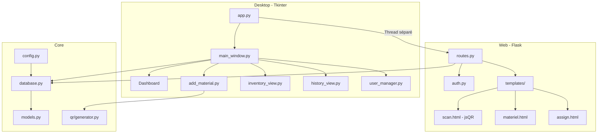

# VIGILE — Plan d'implémentation

> *"Chaque équipement a sa sentinelle"*

Système de gestion et traçabilité de matériel informatique avec QR Codes.

## Environnement détecté

| Élément | Valeur |
|---------|--------|
| Python | 3.13.5 |
| Tkinter | ✅ Disponible |
| OS | Linux (dev) — cible Windows 10/11 |
| Workspace | `/home/maverick/Vigile-1.0/` |

---

## User Review Required

> [!IMPORTANT]
> **Compte admin par défaut** — Le premier lancement créera automatiquement :
> - Username : `admin`
> - Password : `admin123`
> - Rôle : `admin`
> 
> Ce mot de passe devra être changé après la première connexion. Est-ce acceptable ?

> [!IMPORTANT]
> **Port Flask par défaut** — Le serveur web sera configuré sur le port `5000`. Confirme si un autre port est préféré.

> [!WARNING]
> **OS de développement** — Tu es sur Linux. Tkinter fonctionnera, mais l'apparence sera différente de Windows. Le code sera compatible Windows 10/11 comme demandé.

---

## Architecture globale



---

## Phases de développement

### Phase 1 — Fondation : `config.py` + `database.py` + `models.py`

#### [NEW] [config.py](file:///home/maverick/Vigile-1.0/config.py)
- Classe `Config` avec toutes les constantes :
  - `SECRET_KEY` : clé secrète Flask (générée via `secrets.token_hex(32)`)
  - `FLASK_PORT` : `5000`
  - `DATABASE_PATH` : `vigile.db` (racine du projet)
  - `QR_CODES_DIR` : `assets/qr_codes/`
  - `BASE_DIR` : chemin absolu du projet
  - `ADMIN_DEFAULT` : credentials admin par défaut

#### [NEW] [database.py](file:///home/maverick/Vigile-1.0/database.py)
- Initialisation du moteur SQLAlchemy avec SQLite
- `SessionLocal` : factory de sessions
- `init_db()` : crée les tables + insère l'admin par défaut si la BD est vide
- Context manager pour les sessions (gestion automatique commit/rollback)

#### [NEW] [models.py](file:///home/maverick/Vigile-1.0/models.py)
- **User** : id, username, email, password_hash, role (admin/gestionnaire), created_at, is_active
  - Méthodes : `set_password()`, `check_password()` (bcrypt)
  - Propriété `is_admin`
- **Materiel** : id, code_vigile (unique, format VIG-YYYY-NNNN), qr_code_path, type, marque, modele, numero_serie, etat, emplacement, date_acquisition, notes, created_at, created_by (FK)
  - Relation avec User (créateur) et Attribution
- **Attribution** : id, materiel_id (FK), attribue_a, date_attribution, date_retour, attribue_par (FK), notes, is_active
  - Relations avec Materiel et User

**Test** : Script de vérification — créer la BD, insérer un user, un matériel, une attribution, puis requêter.

---

### Phase 2 — Générateur QR : `qr/generator.py`

#### [NEW] [qr/generator.py](file:///home/maverick/Vigile-1.0/qr/generator.py)
- `generer_qr_code(code_vigile, host, port)` → génère un QR PNG pointant vers `http://{host}:{port}/materiel/{code_vigile}`
- Sauvegarde dans `assets/qr_codes/{code_vigile}.png`
- Retourne le chemin du fichier généré
- Taille configurable, logo VIGILE optionnel au centre
- Gestion d'erreurs : répertoire inexistant, permissions, etc.

**Test** : Générer un QR code de test et vérifier qu'il est lisible.

---

### Phase 3 — Desktop principal : `main_window.py` + `add_material.py`

#### [NEW] [desktop/main_window.py](file:///home/maverick/Vigile-1.0/desktop/main_window.py)
- **LoginFrame** : écran de connexion (username + password) avec validation bcrypt
- **MainWindow** : fenêtre principale avec :
  - Barre latérale de navigation (Dashboard, Inventaire, Ajouter, Historique, Users, Serveur Web)
  - Zone de contenu dynamique (frame switching)
  - Barre de statut (utilisateur connecté, état serveur)
- **DashboardFrame** : 4 cartes de stats (total matériel, attribué, disponible, en panne)
- **ServerFrame** : bouton Start/Stop Flask, affichage IP locale, QR code de l'URL du serveur
- Style Tkinter soigné avec `ttk` et thème cohérent

#### [NEW] [desktop/add_material.py](file:///home/maverick/Vigile-1.0/desktop/add_material.py)
- Formulaire complet avec tous les champs du modèle Materiel
- Génération automatique du `code_vigile` (VIG-YYYY-NNNN, auto-incrément)
- Génération QR à la sauvegarde
- Aperçu du QR code dans le formulaire (via `Pillow` → `ImageTk`)
- Validation des champs obligatoires
- Boutons : Sauvegarder, Réinitialiser

**Test** : Lancer la fenêtre, se connecter avec admin/admin123, ajouter un matériel, vérifier le QR généré.

---

### Phase 4 — Vues Desktop : `inventory_view.py` + `history_view.py`

#### [NEW] [desktop/inventory_view.py](file:///home/maverick/Vigile-1.0/desktop/inventory_view.py)
- `Treeview` listant tout le matériel avec colonnes : Code, Type, Marque, Modèle, État, Emplacement
- Filtres en haut : combo type, combo état, combo emplacement, champ recherche
- Double-clic : ouvre la fiche détaillée du matériel (popup)
- Bouton "Imprimer QR" : ouvre le fichier QR PNG associé
- Bouton "Attribuer" : dialogue d'attribution rapide
- Rafraîchissement automatique du tableau

#### [NEW] [desktop/history_view.py](file:///home/maverick/Vigile-1.0/desktop/history_view.py)
- `Treeview` listant toutes les attributions : Matériel, Attribué à, Date attribution, Date retour, Par
- Filtre par nom de personne (champ de recherche)
- Filtre par matériel
- Indicateur visuel : attribution active (vert) vs terminée (gris)

**Test** : Ajouter plusieurs matériels et attributions, vérifier les filtres et l'affichage.

---

### Phase 5 — Gestion utilisateurs : `user_manager.py`

#### [NEW] [desktop/user_manager.py](file:///home/maverick/Vigile-1.0/desktop/user_manager.py)
- Accessible uniquement si `role == 'admin'`
- Liste des utilisateurs avec état (actif/inactif)
- Formulaire d'ajout : username, email, password, rôle
- Bouton activer/désactiver (pas de suppression, pour garder l'historique)
- Validation : username unique, email valide

**Test** : Créer un gestionnaire, le désactiver, vérifier qu'il ne peut plus se connecter.

---

### Phase 6 — Web Backend : `auth.py` + `routes.py`

#### [NEW] [web/auth.py](file:///home/maverick/Vigile-1.0/web/auth.py)
- Configuration Flask-Login : `login_manager`, `user_loader`
- Classe wrapper `FlaskUser` compatible Flask-Login (wraps le modèle SQLAlchemy User)
- Routes `/login` (GET/POST) et `/logout`
- Décorateur `@login_required` sur les routes protégées

#### [NEW] [web/routes.py](file:///home/maverick/Vigile-1.0/web/routes.py)
- `GET /` → redirige vers `/scan`
- `GET /scan` → page scanner QR
- `GET /materiel/<code_vigile>` → fiche matériel (JSON ou HTML selon Accept header)
- `POST /materiel/<code_vigile>/attribuer` → attribuer le matériel
- `POST /materiel/<code_vigile>/recuperer` → récupérer le matériel
- `create_flask_app()` : factory function qui construit l'app Flask complète

**Test** : Démarrer Flask manuellement, tester les routes avec un navigateur.

---

### Phase 7 — Templates Web : `web/templates/`

#### [NEW] [base.html](file:///home/maverick/Vigile-1.0/web/templates/base.html)
- Layout mobile-first responsive
- CSS vanilla intégré : palette VIGILE (bleu foncé/doré), typo Inter
- Header avec logo/nom, navigation, user info
- Footer minimal
- Blocks Jinja2 : title, content, scripts

#### [NEW] [login.html](file:///home/maverick/Vigile-1.0/web/templates/login.html)
- Formulaire username/password centré
- Messages d'erreur stylisés
- Branding VIGILE

#### [NEW] [scan.html](file:///home/maverick/Vigile-1.0/web/templates/scan.html)
- Accès caméra via `navigator.mediaDevices.getUserMedia()`
- Décodage QR via `jsQR` (chargé en local ou CDN)
- Affichage du flux vidéo + zone de détection
- Redirection automatique vers la fiche matériel après scan réussi
- Fallback : champ de saisie manuelle du code

#### [NEW] [materiel.html](file:///home/maverick/Vigile-1.0/web/templates/materiel.html)
- Fiche complète du matériel : toutes les infos
- État actuel avec badge coloré
- Attribution actuelle (si applicable)
- Boutons : "Attribuer" / "Récupérer" selon l'état

#### [NEW] [assign.html](file:///home/maverick/Vigile-1.0/web/templates/assign.html)
- Formulaire d'attribution : nom de la personne + notes
- Ou confirmation de récupération
- Page de succès avec résumé

**Test** : Naviguer sur mobile, scanner un QR, attribuer/récupérer du matériel.

---

### Phase 8 — Point d'entrée : `app.py`

#### [NEW] [app.py](file:///home/maverick/Vigile-1.0/app.py)
- Initialise la base de données
- Crée l'app Flask via la factory
- Lance Flask dans un `threading.Thread(daemon=True)`
- Lance la fenêtre Tkinter dans le thread principal
- Gestion propre de l'arrêt (cleanup du thread Flask)
- Argument CLI optionnel : `--web-only` pour lancer uniquement Flask (serveur headless)

#### [NEW] [requirements.txt](file:///home/maverick/Vigile-1.0/requirements.txt)
```
Flask>=3.0
Flask-Login>=0.6
SQLAlchemy>=2.0
bcrypt>=4.0
qrcode>=7.4
Pillow>=10.0
```

**Test final** : Lancer `python app.py`, vérifier que Tkinter et Flask fonctionnent simultanément.

---

## Open Questions

> [!IMPORTANT]
> 1. **Mot de passe admin par défaut** : `admin` / `admin123` — est-ce OK ?
> 2. **Port Flask** : `5000` par défaut — convient-il ?
> 3. **jsQR** : Préfères-tu un chargement via CDN (nécessite internet) ou inclure le fichier JS en local dans le projet ?
> 4. **L'utilisateur demande de procéder étape par étape avec validation.** Je vais donc implémenter la **Phase 1** uniquement (`config.py` + `database.py` + `models.py`) et attendre ta validation avant de continuer. Confirme cette approche.

---

## Verification Plan

### Tests automatisés (par phase)
- Phase 1 : Script Python qui crée la BD, insère des données, vérifie les relations
- Phase 2 : Génération d'un QR code de test + vérification fichier
- Phase 3-5 : Lancement Tkinter, tests manuels de l'interface
- Phase 6-7 : Requêtes HTTP de test sur les routes Flask
- Phase 8 : Test intégration complète (Tkinter + Flask simultanés)

### Vérification manuelle
- Scanner un QR code depuis un téléphone sur le réseau local
- Parcours complet : ajout matériel → scan QR → attribution → récupération
